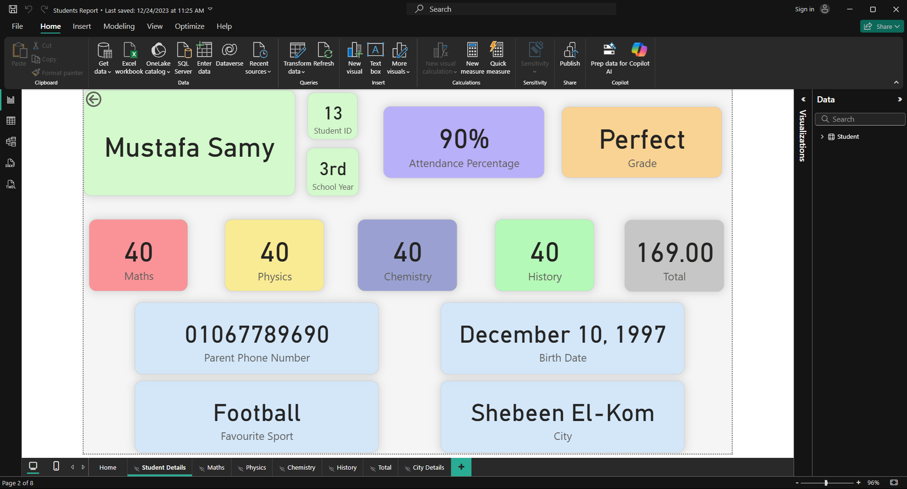
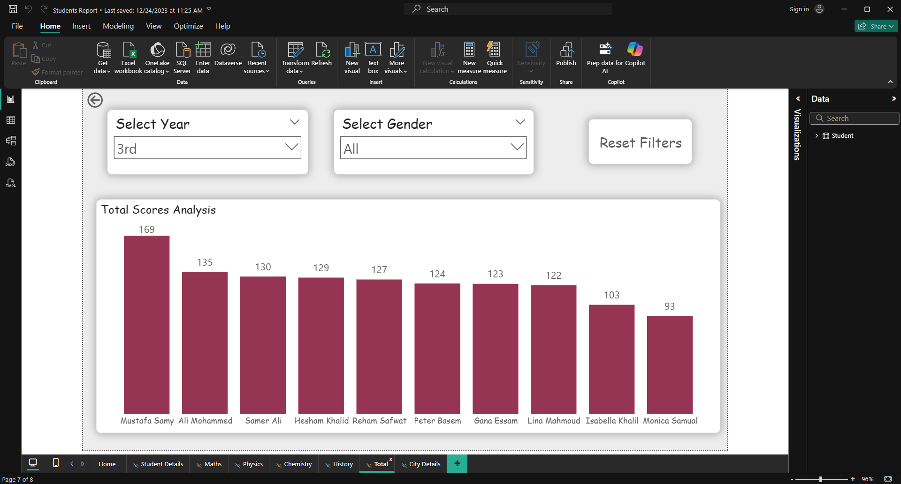
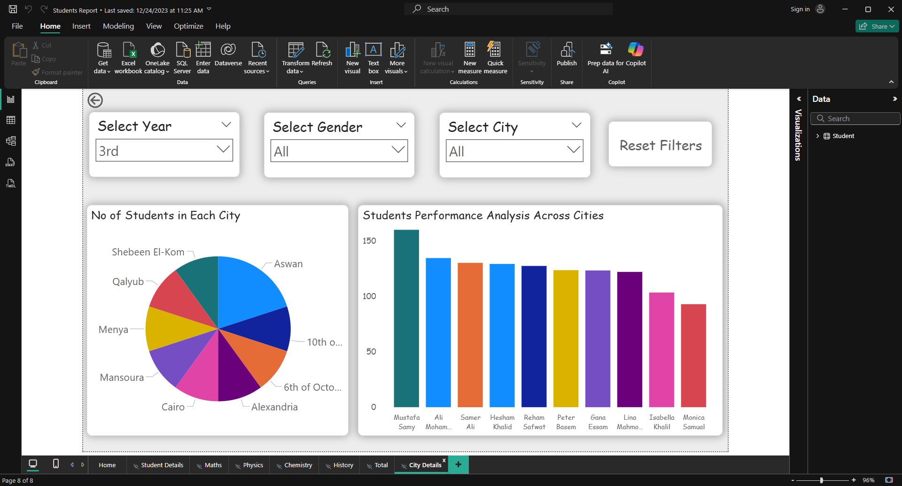
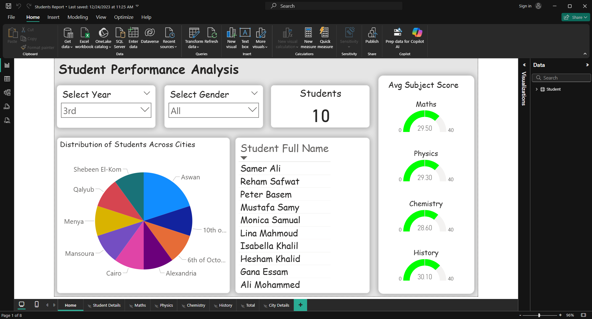

# Student Performance Analysis

This Power BI project analyzes student performance and academic results.  
The dashboard provides insights into grade distribution, subject-wise performance, and overall academic trends.

---

## Dashboard Highlights
- **Overall Performance** → Average grades across all students.
- **Subject Breakdown** → Compare performance across different subjects.
- **Top & Low Performers** → Identify students excelling or struggling.
- **Grade Distribution** → Visualize grade ranges.
- **Trend Analysis** → Track progress across exams or academic terms.

---

## Files in Repository
- Students Report.pbix → Power BI report file.
- Students.txt → Source dataset used.
- screenshots/ → Example dashboard visuals.

---

## How to Use
1. Download the `.pbix` file.  
2. Open it in **Power BI Desktop**.  
3. Explore the visuals interactively.  

---

## Skills Demonstrated
- Data cleaning and modeling  
- DAX measures and calculated columns  
- Interactive dashboard design  
- Data storytelling & performance analysis  

## Dashboard Screenshots

### Student Details

### Total Score Analysis

### Performance Across Cities

### Overall View on Student Performance

